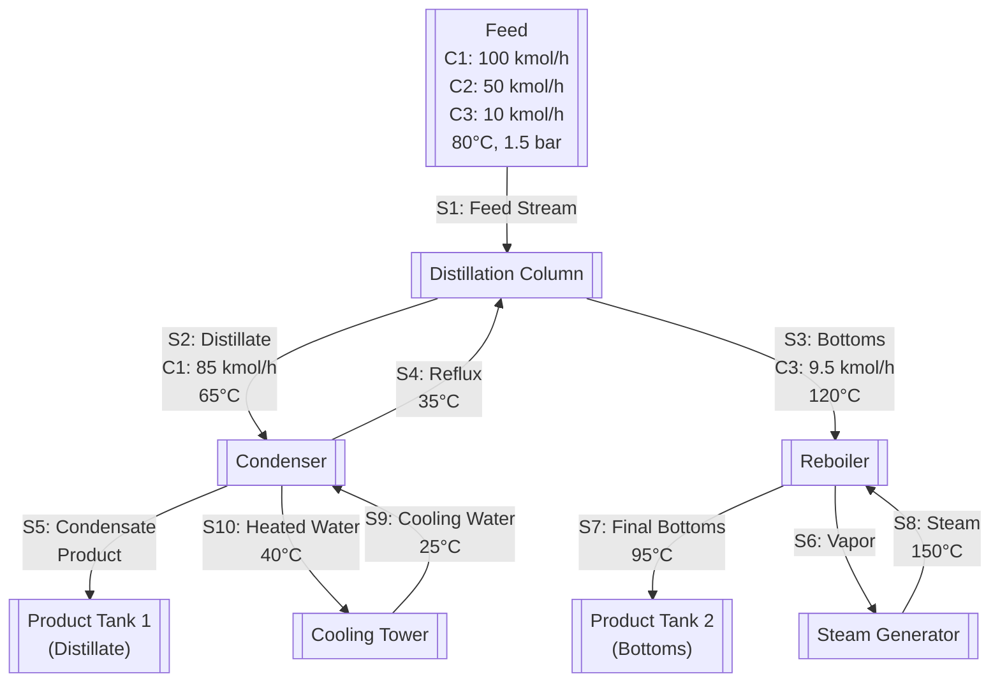

# Distillation Column Optimization Example

Example of using usolver to optimize a distillation column design end to end with Claude API.

## Process Flowsheet



## Usage

1. **Start MCP Server**
   ```bash
   uv run mcp run usolver_mcp/server/main.py
   ```

2. **Set API Key and Run Client**
   ```bash
   export ANTHROPIC_API_KEY='your-api-key-here'
   uv run --with anthropic examples/full/client.py
   ``` 