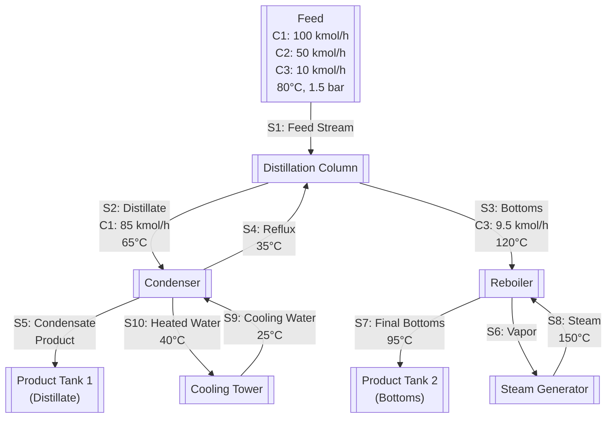

# Distillation Column Optimization Example

Example of using usolver to optimize a distillation column design end to end with Claude API.

## Problem Statement

There is a toy specification for a separation plant that takes a mixed feed stream containing three different chemicals (C1, C2, and C3) and separates them into two purified products. A very simplified version of the design behind a whiskey distillery or oil refinery, we start with a crude mixture and end up with separate, purified products. In this case, we're turning a 3-component mixture into two pure streams as output. The plant uses heat and cooling to exploit the fact that different chemicals boil at different temperatures, allowing for clean separation.

1. **Feed Input**: A mixture of three chemicals enters the system at 80°C
   - Component 1 (C1): 100 kmol/h
   - Component 2 (C2): 50 kmol/h
   - Component 3 (C3): 10 kmol/h

2. **Distillation Column**: Separates the mixture by taking advantage of different boiling points:
   - **Lighter components** (C1) rise to the top as vapor
   - **Heavier components** (C3) sink to the bottom as liquid

3. **Two Main Outputs**:
   - **Top Product (Distillate)**: Mostly pure C1 (85 kmol/h) - collected in Product Tank 1
   - **Bottom Product**: Mostly pure C3 (9.5 kmol/h) - collected in Product Tank 2

4. **Equipment**:
   - **Condenser**: Cools the top vapor back to liquid using cooling water
   - **Reboiler**: Heats the bottom liquid to create vapor using steam
   - **Cooling Tower**: Recycles cooling water
   - **Steam Generator**: Provides heat energy

The goal is to find the optimal design configuration that minimizes the total annual cost while meeting strict product purity requirements. We need to determine the optimal number of trays, reflux ratio, feed tray location, and column diameter that will achieve at least 95% purity for Component 1 in the distillate and 90% purity for Component 3 in the bottoms product.

The optimization must balance capital costs (equipment sizing) against operating costs (steam and cooling water consumption) while satisfying physical constraints of pressure drop limits, tray efficiency requirements, and flooding prevention.

## Process Flowsheet



## Usage

1. **Start MCP Server**
   ```bash
   uv run mcp run usolver_mcp/server/main.py
   ```

2. **Set API Key and Run Client**
   ```bash
   export ANTHROPIC_API_KEY='your-api-key-here'
   uv run --with anthropic examples/full/client.py
   ``` 